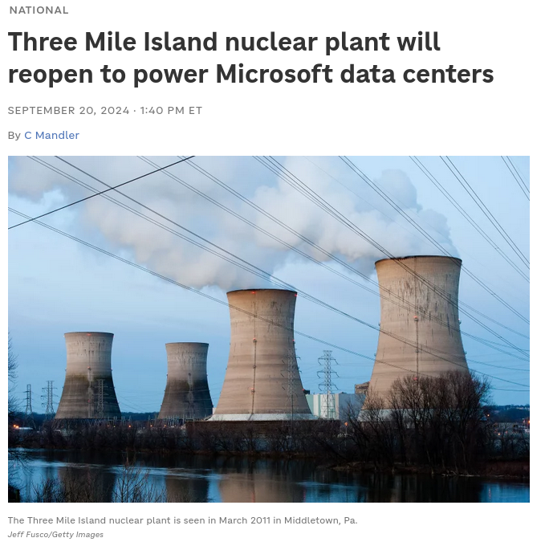
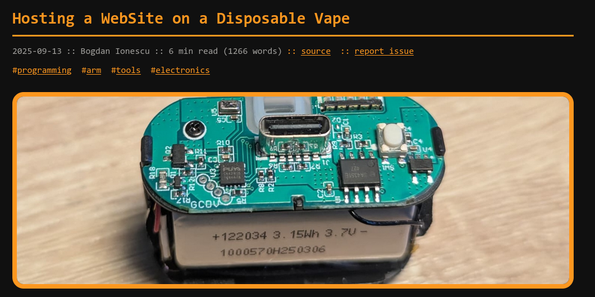

## Entwicklung von Deployment

::: {.columns}

::: {.column width="33%"}

:::

::: {.column width="33%"}

:::

::: {.column width="33%"}

:::

:::

::: notes
- viel vor in wenig Zeit, man mus nicht alles verstehen: wir teilen uns gleich in zwei gruppen auf nach erfahrungslevel
- versuch beide gruppen zu bedienen und versuch raum zu öffnen für den gesamten Umfang von Deployment und was für Begriffe/Technologien hier eine Rolle spielen, 
- auf ein paar Aspekte detalierter am Beispiel von CorrelAid eingehen
- eine Lösung für viele der Probleme: Coolify vorstellen

- wie viele bestimmt wissen, wurde das world wide web um 1990 am CERN erfunden
- hier sind man den ersten web server: 
  - web server = software die anfragen von user agents akzeptiert und eine antwort zurückschickt
  - von statischen html Dateien bis zu von Large Language Models generierten Texten
  - ersteres benötigt wesentlich weniger Energie als letzteres (Atomreaktoren), aber gleiches Prinzip
  - Arbeit/Anwendungen werden immer web/cloud-basierter, Beispiel Office-Programme 

::: 

## Was ist Deployment?

**Self-Hosting von Open Source**

- Self-Hosting: Verantwortung liegt bei einem selbst, Anwendung liegt in eigener Einflussphäre
- Beispiel: Self-Hosting von [Nextcloud](https://nextcloud.com/) oder [OpenProject](https://www.openproject.org/)

**Deployment von eigenem Code**

- Kann über Self-Hosting geschehen
- PaaS-Anbieter (Platform as a Service, z.B. [Vercel](https://vercel.com/); [Heroku](https://www.heroku.com/))
- Beispiel: Diese Präsentation ist deployed über [GitHub Pages](https://pages.github.com/) (als static website)

::: notes
- Bezug auf Anwendungen, die auf Servern laufen und über das Internet erreichbar sind
::: 

## Umfang von Deployment: Infrastruktur

**Wo läuft die Anwendung?**

- Unterschiedliche Abstraktionslevel: 
  - Server im Keller (On Premises)
  - Server bei einem Cloud Provider gemietet (oft VPS: Virtual Private Server)
  - PaaS/CaaS (Platform bzw. Container as a Service)
- Je nach Wahl: man ist selbst verantwortlich für das Betriebssystem  
  (OS Administration, z.B. Linux-Distribution wie [Debian](https://www.debian.org/))

**Wie ist die Anwendung erreichbar?**

- Eine lesbare Adresse (z.B. civic-data.de) muss mit der  
  Server-IP verknüpft werden → **DNS Management**

::: notes
- Analogie DNS: wie ein Telefonbuch – Name rein, Nummer raus
:::

## Umfang von Deployment: Updates & Wartung

- Deployment ist eine kontinuierliche Tätigkeit

**Wie halte ich alles aktuell?**

- Die Anwendung selbst: neue Features, Bugfixes
- Das Betriebssystem und Requirements: Sicherheitslücken werden  
  regelmäßig geschlossen

## Umfang von Deployment: Monitoring

**Merke ich, wenn etwas schiefläuft?**

- Ist die Anwendung noch erreichbar? → **Uptime Monitoring**
- Werden CPU, RAM oder Speicher knapp? → **Ressourcen-Monitoring**
- ➡️ **Notifications** (z.B. E-Mail wenn correlaid.org down ist)

::: notes
- Ohne Monitoring erfährt man von Ausfällen oft erst durch Nutzende
- Frühwarnung verhindert, dass kleine Probleme große werden
:::

## Umfang von Deployment: Sicherheit & Datenschutz

**Wer darf auf die Anwendung zugreifen?**

- Unerwünschten Traffic blockieren → **Firewalls**
- Klare Regeln, wer sich einloggen kann → **Access Management**

**Was bedeutet das für den Datenschutz?**

- Wo werden Daten gespeichert? (EU vs. USA)
- Wer hat theoretisch Zugriff auf die Daten?
- ggf. spezielle Verträge mit Cloud Providern notwendig
- ggf. Zertifizierungen notwendig

## Deployment bei CorrelAid

- Self-Hosting von unter anderem [Metabase](https://www.metabase.com/), [OpenProject](https://www.openproject.org/), [LimeSurvey](https://www.limesurvey.org/) und [Directus](https://directus.io/)
- Self-Hosting von Eigenentwicklungen wie:
  - [correlaid.org](https://correlaid.org)
  - Apps für das CDL wie [umfragen.civic-data.de](https://umfragen.civic-data.de)

::: notes
- Ein paar der genannten Aspekte detailiert besprechen und am Beispiel von CorrelAid
:::

## Wo deploye ich? - Cloud Provider

- "Ich will mir keinen Server in den Keller stellen." ➡️ Cloud Provider
- Viele Cloud Provider bieten auch DNS Management, Firewalls und PaaS-Lösungen an 
- Die großen drei: [AWS](https://aws.amazon.com/) (Amazon Web Services), [Azure](https://azure.microsoft.com/), [GCP](https://cloud.google.com/) (Google Cloud Platform)
- Europäische Provider: z.B. [Hetzner](https://www.hetzner.com/), [Scaleway](https://www.scaleway.com/), [Netcup](https://www.netcup.eu/)
- Tipp: [lowendbox.com](https://lowendbox.com/)
  - Man kann manche Dinge auf VPS (Virtual Private Server) mit 1 VCPU/1 GB RAM für ~2$/Monat laufen lassen
- ➡️ CorrelAid nutzt hauptsächlich Hetzner

## Exkurs: Infrastructure as Code (IaC)

**Kernidee:** Infrastruktur als Code beschreiben statt manuell klicken.

- **Reproduzierbar** – gleiche Umgebung, überall
- **Nachvollziehbar** – versionierbar via Git
- **Plattformunabhängig** – AWS, Hetzner, DigitalOcean & Co.

| Tool | Frage |
|---|---|
| **Terraform / OpenTofu** | *Was* soll existieren? |
| **Ansible** | *Wie* soll es konfiguriert sein? |

➡️ CorrelAid nutzt OpenTofu + Ansible

## Exkurs: Was sind Container?

Heutzutage laufen Anwendungen meistens in Containern statt direkt auf dem Server.

- Vorteil: eine containerisierte Anwendung läuft auf **jedem** Betriebssystem gleich
- Kein "bei mir läuft das aber" — die Umgebung ist immer identisch
- **[Docker](https://www.docker.com/)** ist das verbreitetste Tool: man beschreibt die Umgebung  
  einmal in einem *Image*, der Container läuft überall

::: notes
- Image = Bauplan, Container = laufende Instanz davon
:::

## Exkurs: Container Orchestration

Wenn eine Anwendung aus mehreren Containern besteht  
(z.B. App + Datenbank + Cache), oder *High Availability* wichtig ist, braucht man ein Tool das sie (über mehrere Server) zusammenhält und ihren Lebenszyklus administriert.

| Tool | Für was? | |
|---|---|---|
| **[Docker Compose](https://docs.docker.com/compose/)** | Mehrere Container auf einem Server | ✅ CorrelAid |
| **[Kubernetes](https://kubernetes.io/)** | Hunderte (replizierte) Container auf mehreren Servern | Overkill für NPOs |

::: notes
- Kubernetes: riesiger Operationsaufwand, lohnt sich erst ab sehr großer Skalierung
- Docker Compose: eine YAML-Datei beschreibt alle Container und wie sie kommunizieren
:::

## Coolify als PaaS

- ➡️ CorrelAid nutzt [Coolify](https://coolify.io/) als PaaS
  - Früher Vercel als PaaS für Website und OpenTofu/Ansible managed Docker Compose auf VPS
  - Vor Kurzem Umstieg auf [Coolify](https://coolify.io/) (self-hosted)
- Freie Auswahl von Cloud Providern (Standort)
- Alles unter eigener Kontrolle, aber trotzdem Komplettlösung mit Best Practices
- Keine Abhängigkeit von externen Anbietern und Features, für die man extra bezahlen muss

## Coolify: Server-Management 

### Features 

- Reverse Proxy (https)
- Automatisierte OS Updates 
- Metrics 

##  Coolify: Anwendungen

### Features 

- Verschieden Deployment-Modi: Docker Compose, [Nixpacks](https://nixpacks.com/) und mehr
- Verknüpfung mit [GitHub](https://github.com/) Repositories mit Rolling Updates
- Basic Auth: Passwortgeschützte Anwendungen

## Outro

- Blog Post: [correlaid.org/blog/cool-kayak/](https://correlaid.org/blog/cool-kayak/)
- Vielen Dank :)